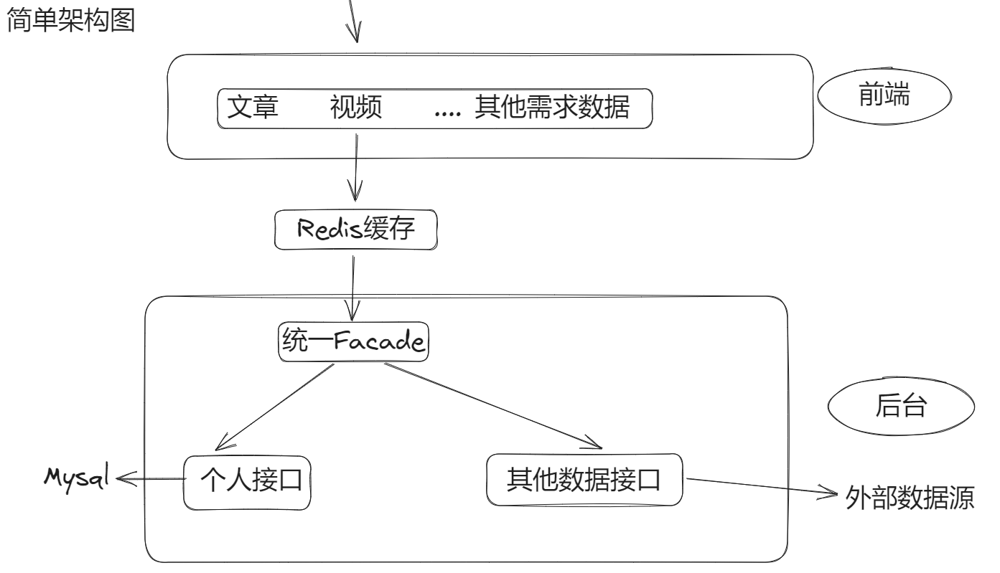

## CAISO-Search

> 基于 Spring Boot + Elastic Stack+Vue的一站式信息聚合搜索平台。用户可在同一页面集中搜索出不同来源、不同类型的内容，如接口，文章，图片，用户等数据

## 项目展示

文章搜索：

图片搜索：

用户搜索：

视频搜索：

## 项目背景

本人做过多个系统发现搜索业务几乎是每个系统都需要的一个功能，并且自己平时开发一直有在用不同的搜索引擎，比如百度搜索，必应搜索等，一直也好奇他们是如何实现这么厉害的搜索功能的。怀揣着这样的好奇心，并且自己的业务也有需求，遂萌生了开发此系统的想法

## 业务功能

- ES灵活检索帖子 ( IK分词器 )
- Hutool请求阿B视频接口
- Jsoup+CSS抓取必应图片
- 查询个人Api开放接口平台存在的Api们
- LogStash同步ES和Mysql
- 常用后台增删改查( 接口暴露但是未开放 )
- Redis缓存查询数据

### 设计模式

- 注册器模式
    - 使用注册器模式管理所有的数据搜索源
    - 配合适配器模式可以实现快速接入并使用新数据源

- 门面模式
    - manager包中的SearchFacade进行搜索的同一处理
    - dataSourceRegistry作为一个存储数据源搜索工具的容器

- 适配器模式
    - 统一数据源DataSource的接口标标准
    - 在新数据源接入时,只需要实现对应的接口完成接口适配就可以直接调用

## 使用功能

### 主流框架 & 特性

- Spring Boot 2.7.x ✔
- Spring MVC ✔
- MyBatis + MyBatis Plus 数据访问（开启分页） ✔
- Spring Boot 调试工具和项目处理器 ✔
- Spring AOP 切面编程 ✔
- Spring Scheduler 定时任务 ✔
- Spring 事务注解 ✔

### 数据存储

- MySQL 数据库 ✔
- Redis 内存数据库 ✔
- Elasticsearch 搜索引擎 ✔
- LogStash 进行数据同步
    - 如果存在大量删除业务, 建议Canal

### 工具类

- Hutool 工具库 ✔
- Gson 解析库 ✔
- Apache Commons Lang3 工具类 ✔
- Lombok 注解 ✔

### 业务特性

- 全局请求响应拦截器（记录日志） ✔
- 全局异常处理器 ✔
- 自定义错误码 ✔
- 封装通用响应类 ✔
- Swagger + Knife4j 接口文档 ✔
- 自定义权限注解 + 全局校验 ✔
- 全局跨域处理 ✔ ( 后端处理 )
- 多环境配置 ✔

